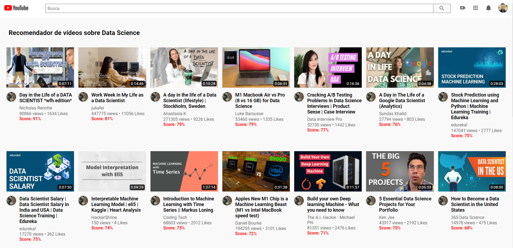

# Youtube Recommender
> Projeto de Machine Learning para recomendação de vídeos do youtube com o tema de Data Science.

 

 

## 💻 Descrição do Projeto

Nesse projeto, o problema de negócio emulado é: <b>atualmente gasto muito tempo procurando novos vídeos do tema de Data Science que realmente tem um 
fit com os vídeos que me interessam</b>. Para resolver esse problema, foi pensado em criar um algoritmo para recomendação de vídeos sobre Data Science onde
neles eu tivesse um <b>Score</b> para servir de métrica avaliadora de quais vídeos eu mais gostaria.

## 💻 Aplicação da Solução

- [x] Extração de dados do Youtube com a lib: [youtube-dl](https://github.com/ytdl-org/youtube-dl)
- [x] Processo de <b>Labeling</b> onde categorizei quais vídeos eu assistiria e quais eu não assistiria
- [x] Criação do Algoritmo Classificador:

    - [x] Criação de um primeiro modelo simples para servir de baseline com as métricas <b>Precisão</b> e <b>ROC AUC</b>
    - [x] Criação de modelos mais elaborados com Active Learning, TFIDF, Random Forest
    - [x] Criação de ensemble com os algoritmos que trouxeram as melhores métricas 
 
 - [x] Deploy local com Docker
 - [x] Deploy com [Heroku](https://www.heroku.com/) para criação do serviço em URL pública

 

> 👨‍💻 Projeto disponível [AQUI](https://youtube-recommender-1195.herokuapp.com/)
